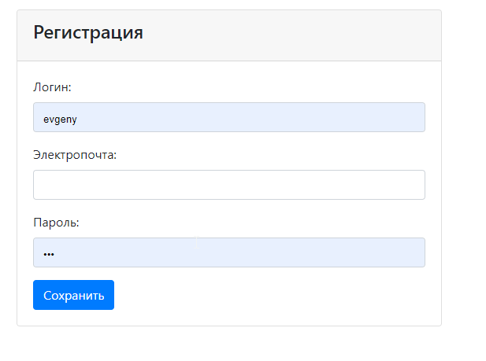
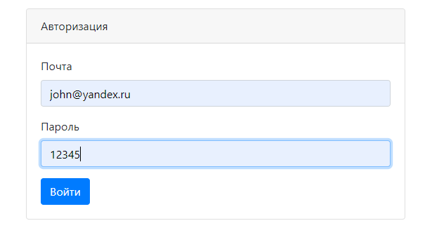
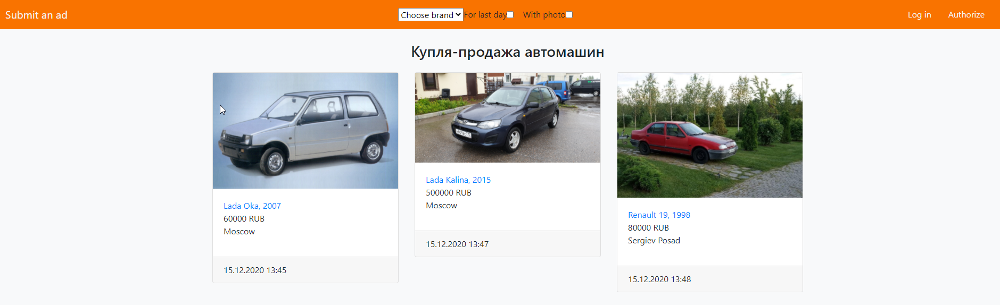
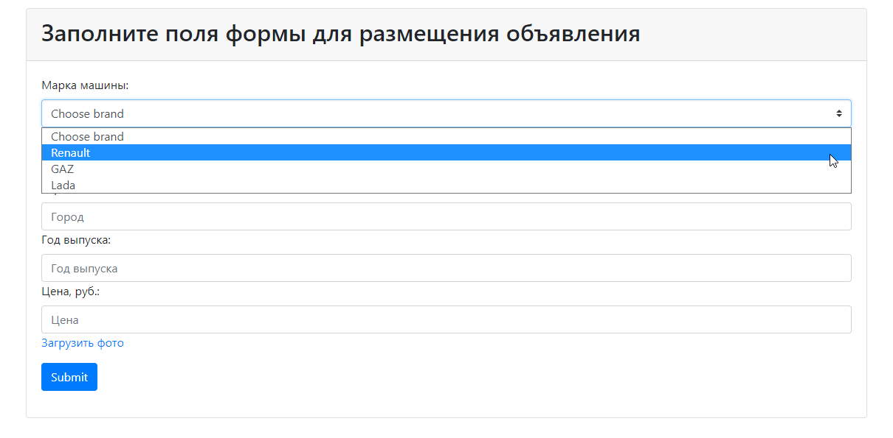
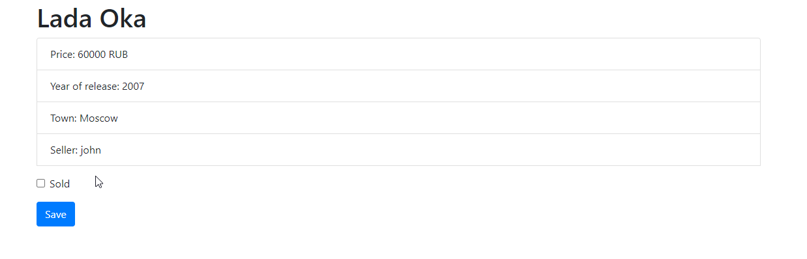
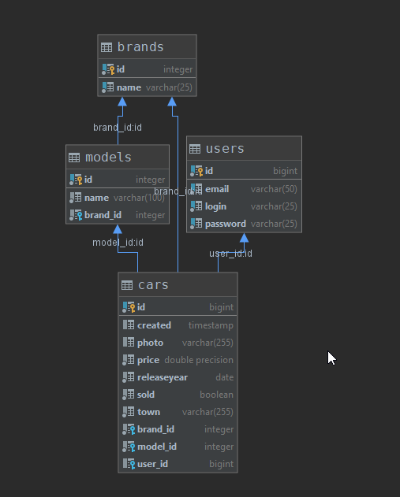

## job4j_sellcars 

### Описание
Площадка для продажи автомобилей. 
Позволяет пользователям выставлять свои автомобили на продажу. 
Объявления сохраняются в базе данных, изображения на сервере. 

### Технологии
- Java 12
- Java Servlets
- Apache Tomcat
- Hibernate
- PostgreSQL 10
- JS, AJAX 
- HTML, Bootstrap 4
- hsqldb
- Apache fileUpload
- Maven
- log4j 2

### Функциональность
#### Регистрация.

#### Авторизация. 

#### Главная страница по списком всех тем.

#### Добавление объявления

#### Просмотр объявления

#### Схема базы данных

